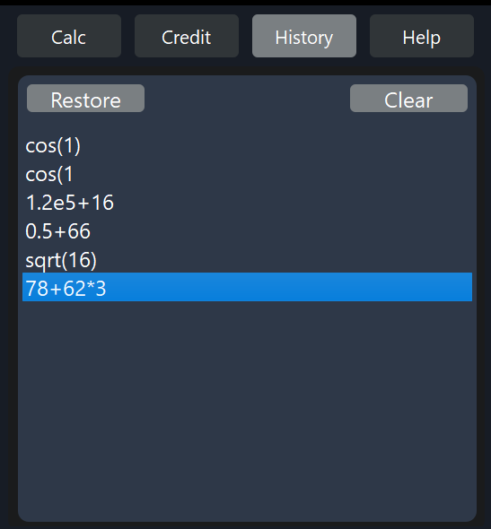

# SmartCalc v3.0 (Individual project)

Implementation of SmartCalc v3.0 in Python (desktop application).

The app was developed in Python 3.11 using MVVM pattern. The model is a library in C++ from the previous version (SmartCalc v2.0) with a wrapper in Python. The view (frontend) was developed using Qt 6.5.2 (Python).

The installer uses Qt Installer Framework. Was tested with Linux and Windows.

  
App images

  
Installer images

## Score:

The final score is 115% (max, without [bonus part3](#part-3-bonus-deposit-calculator)).

## Task

## Part 1. SmartCalc v3.0 implementation

- The program must be developed in Python 3.11
- Prepare the installer, which will install the application to the system with the standard settings (installation path, creating shortcut)
- Prepare an implementation with a graphical user interface for either Linux or Mac OS, based on any GUI library or framework (GUI layer implementation in HTML/CSS/JS is acceptable)
- The program must be implemented using the MVVM or MVP pattern, and
  - there should be no business logic code in the view code
  - there must be no interface code in the model, presenter and view model
- The "core" of the calculator in the form of an algorithm for the formation and calculation of the Polish notation and various computational functions connect as a dynamic library in C/C++ from the SmartCalc v1.0 or SmartCalc v2.0 projects
- The model should be a "core" with a wrapper in Python
- The model must have all the calculator's functionality so that it can be used in the future without the other layers
- Prepare full coverage of methods in the model layer with unit tests
- The application should have a help section with a description of the program interface in random form
- The program must save the history of operations, allow loading expressions from the history and clear the entire history
- History must be saved between runs of the application
- Both integers and real numbers, written either via a point or in exponential form, can be input to the program
- Calculation should be performed after the complete entry of the calculated expression and pressing the symbol `=`
- Calculation of arbitrary bracketed arithmetic expressions in infix notation
- Calculation of arbitrary bracketed arithmetic expressions in infix notation with substitution of _x_ variable as a number
- Plotting a function defined using an expression in infix notation with the variable _x_ (with coordinate axes, scale marker, and grid with adaptive step)
  - It is not necessary to provide the user with the ability to change the scale
- The range of definition and the range of value of the functions are at least limited to numbers from -1000000 to 1000000
- To plot a function it is necessary to additionally specify the displayed area of definition and area of value
- Checked accuracy of the fractional part is at least 7 decimal places
- The user must be able to enter up to 255 characters
- Bracketed arithmetic expressions in infix notation must support the following arithmetic operations and mathematical functions:
  - **Arithmetic operators**:

      | Operator name | Infix Notation  (Classic) | Prefix notation   (Polish notation) | Postfix notation  (Reverse Polish notation) |
      | ------ | ------ | ------ | ------ |
      | Parentheses | (a + b) | (+ a b) | a b + |
      | Addition | a + b | + a b | a b + |
      | Subtraction | a - b | - a b | a b - |
      | Multiplication | a * b | * a b | a b * |
      | Division| a / b | / a b | a b \ |
      | Rasing to the power | a ^ b | ^ a b | a b ^ |
      | Remainder of division | a mod b | mod a b | a b mod |
      | Unary plus | +a | +a | a+ |
      | Unary minus | -a | -a | a- |

      >Please note that the multiplication operator contains a mandatory `*` sign. Processing an expression with the `*` sign omitted is optional and left to the developer's discretion

      | Function description | Function |
      | ---------------- | ------- |
      | Calculates cosine | cos(x) |
      | Calculates sine | sin(x) |
      | Calculates tangent | tan(x) |
      | Calculates arc cosine | acos(x) |
      | Calculates the arcsine | asin(x) |
      | Calculates arctangent | atan(x) |
      | Calculates square root | sqrt(x) |
      | Calculates natural logarithm | ln(x) |
      | Calculates decimal logarithm | log(x) |

## Part 2. Bonus. Loan сalculator

Provide a special mode "loan calculator" (you can take websites like banki.ru and calcus.ru as an example):

- Input: total loan amount, term, interest rate, type (annuity, differentiated)
- Output: monthly payment, overpayment for the loan, total repayment

## Part 3. Bonus. Deposit calculator

Provide a special mode "deposit calculator" (you can take websites like banki.ru and calcus.ru as an example):

- Input: deposit amount, deposit term, interest rate, tax rate, periodicity of payments, capitalization of interest, list of additions, list of partial withdrawals
- Output: accrued interest, tax amount, amount on deposit by the end of the term

## Part 4. Bonus. Configuration and logging

Add settings to the app:

- Add reading of settings from configuration file when the program runs
- Include in the configuration file 3 or more parameters to choose from, such as background color, font size, etc.
- Add descriptions of editable parameters to help

Add logging to the application:

- Store operation history in logs
- Save logs in the logs folder, one file per rotation period
- It should be possible to set the period of logs rotation (hour/day/month)
- Files must be named according to the following pattern: `logs_dd-MM-yy-hh-mm-ss` ( the time of file creation )

## Part 5. Bonus. Cross-platform

Make your app cross-platform:

- Add support Linux, Mac and Windows
- The installer should also be available for Linux, Mac and Windows (several different installers are allowed)
